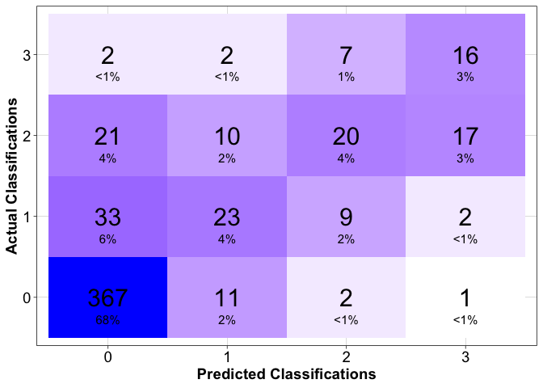
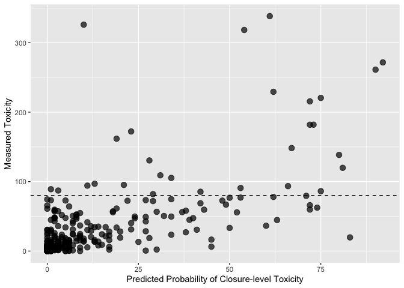
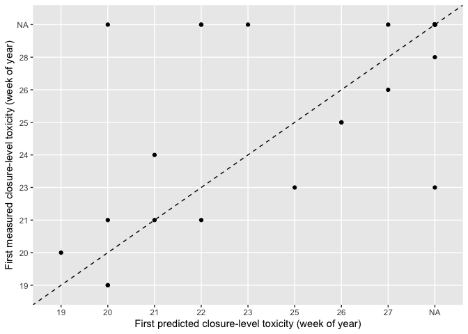

pspforecast
================

Shellfish toxicity forecast serving package

## Requirements

- [R v4+](https://www.r-project.org/)

- [rlang](https://CRAN.R-project.org/package=rlang)

- [dplyr](https://CRAN.R-project.org/package=dplyr)

- [readr](https://CRAN.R-project.org/package=readr)

- [tidyr](https://CRAN.R-project.org/package=tidyr)

## Installation

    remotes::install_github("BigelowLab/pspforecast")

## Reading the forecast database

### Variables:

- version - the version/configuration of the model used to make the
  prediction

- ensemble_n - number of ensemble members used to generate prediction

- location - the sampling station the forecast is for

- date - the date the forecast was made on

- name - site name

- lat - latitude

- lon - longitude

- class_bins - the bins used to classify shellfish total toxicity
  (i.e. 0: 0-10, 1: 10-30, 2: 30-80, 3: \>80)

- forecast_date - the date the forecast is valid for (i.e. one week
  ahead of when it was made)

- predicted_class - the predicted classification at the location listed
  on the forecast_date (in this case 0-3)

- p_0 - class 0 probability

- p_1 - class 1 probability

- p_2 - class 2 probability

- p_3 - class 3 probability

- p3_sd - class 3 probability standard deviation

- p_3\_min - class 3 minimum probability (from ensemble run)

- p_3\_max - class 3 maximum probability (from ensemble run)

- predicted_class - the predicted classification

``` r
predictions <- read_forecast(year = "2022")

glimpse(predictions)
```

    ## Rows: 734
    ## Columns: 18
    ## $ version             <chr> "v0.1.3", "v0.1.3", "v0.1.3", "v0.1.3", "v0.1.3", …
    ## $ ensemble_n          <dbl> 10, 10, 10, 10, 10, 10, 10, 10, 10, 10, 10, 10, 10…
    ## $ location            <chr> "PSP19.15", "PSP21.09", "PSP10.11", "PSP10.29", "P…
    ## $ date                <date> 2022-04-04, 2022-04-04, 2022-04-05, 2022-04-05, 2…
    ## $ name                <chr> "Stonington", "Bass Hbr.", "Ogunquit River", "Pine…
    ## $ lat                 <dbl> 44.15419, 44.23824, 43.25030, 43.54459, 43.56632, …
    ## $ lon                 <dbl> -68.65947, -68.34792, -70.59540, -70.33231, -70.27…
    ## $ class_bins          <chr> "0,10,30,80", "0,10,30,80", "0,10,30,80", "0,10,30…
    ## $ forecast_start_date <date> 2022-04-08, 2022-04-08, 2022-04-09, 2022-04-09, 2…
    ## $ forecast_end_date   <date> 2022-04-14, 2022-04-14, 2022-04-15, 2022-04-15, 2…
    ## $ p_0                 <dbl> 98, 98, 98, 98, 98, 98, 98, 98, 98, 98, 92, 98, 99…
    ## $ p_1                 <dbl> 2, 2, 2, 2, 2, 2, 2, 2, 2, 2, 7, 2, 1, 1, 1, 1, 1,…
    ## $ p_2                 <dbl> 0, 0, 0, 0, 0, 0, 0, 0, 0, 0, 1, 0, 0, 0, 0, 0, 0,…
    ## $ p_3                 <dbl> 0, 0, 0, 0, 0, 0, 0, 0, 0, 0, 0, 0, 0, 0, 0, 0, 0,…
    ## $ p3_sd               <dbl> 0.0018874253, 0.0018874253, 0.0018874253, 0.001887…
    ## $ p_3_min             <dbl> 2.114287e-03, 2.114287e-03, 2.114287e-03, 2.114287…
    ## $ p_3_max             <dbl> 0.007679009, 0.007679009, 0.007679009, 0.007679009…
    ## $ predicted_class     <dbl> 0, 0, 0, 0, 0, 0, 0, 0, 0, 0, 0, 0, 0, 0, 0, 0, 0,…

## 2022 Season Performance

### Confusion Matrix

<!-- -->

### Probability of Closure-level Toxicity vs Measured Toxicity

<!-- -->

## Forecast Skill (2022 Season)

#### Overall Metrics:

- - Accuracy of all predictions made that were measured the following
    week

<!-- -->

    ## # A tibble: 1 × 1
    ##   accuracy
    ##      <dbl>
    ## 1    0.797

### Closure-level (Class 3) Prediction Metrics

- tp - The model predicted class 3 and the following week’s measurement
  was class 3
- fp - The model predicted class 3 and the following week’s measurement
  was not class 3
- tn - The model predicted class 0,1,2 and the following week’s
  measurement was in class 0,1,2
- fn - The model predicted class 0,1,2 and the following week’s
  measurement was class 3
- precision - TP/(TP+FP)
- sensitivity - TP/(TP+FN)
- specificity - TN/(TN+FP)

<!-- -->

    ## # A tibble: 1 × 7
    ##      tp    fp    tn    fn precision sensitivity specificity
    ##   <int> <int> <int> <int>     <dbl>       <dbl>       <dbl>
    ## 1    16    20   603    12     0.444       0.571       0.968

## Timing of clusre-level predictions

<!-- -->

### Last Updated

    ## [1] "2023-05-16"
