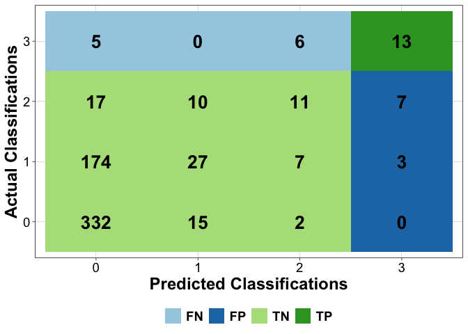
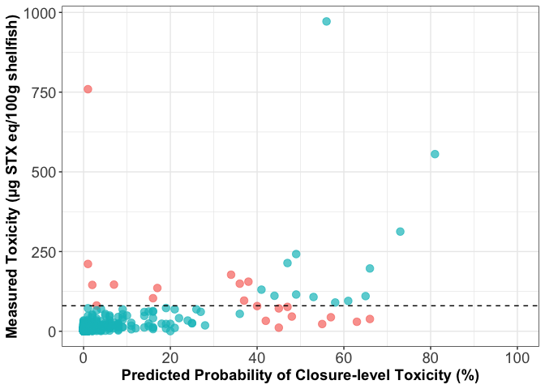

pspforecast
================

Shellfish toxicity (PSP) forecast serving package

For the current 2026 Maine PSP predictions, click
[here](https://github.com/BigelowLab/pspforecast/blob/master/inst/forecastdb/dmr_webpage_table.csv)

For past season results, check out this [shiny
application](https://eco.bigelow.org/pspforecast/)

## Installation

    remotes::install_github("BigelowLab/pspforecast")

## Reading the forecast database

``` r
library(pspforecast)
fc = read_forecast()
glimpse(fc)
```

    ## Rows: 659
    ## Columns: 20
    ## $ version             <chr> "v0.4.0", "v0.4.0", "v0.4.0", "v0.4.0", "v0.4.0", "v0.4.0", "v0.4.0", "v0.4.0", "v0.4.0", "v0.4.0", "v0.4.0", "v0.4.0", "v0.4.0", "v0.4.0", "v0.4.0", "v0.4.0", "v0.4.0", "v0.4.0…
    ## $ ensemble_n          <dbl> 10, 10, 10, 10, 10, 10, 10, 10, 10, 10, 10, 10, 10, 10, 10, 10, 10, 10, 10, 10, 10, 10, 10, 10, 10, 10, 10, 10, 10, 10, 10, 10, 10, 10, 10, 10, 10, 10, 10, 10, 10, 10, 10, 10, 1…
    ## $ location            <chr> "PSP10.11", "PSP10.33", "PSP12.01", "PSP12.03", "PSP12.13", "PSP12.28", "PSP12.34", "PSP21.09", "PSP26.07", "PSP27.05", "PSP27.46", "PSP19.15", "PSP23.07", "PSP24.08", "PSP25.06…
    ## $ date                <date> 2026-04-13, 2026-04-13, 2026-04-14, 2026-04-14, 2026-04-14, 2026-04-14, 2026-04-14, 2026-04-14, 2026-04-14, 2026-04-14, 2026-04-14, 2026-04-15, 2026-04-15, 2026-04-15, 2026-04-…
    ## $ species             <chr> "mytilus", "mytilus", "mytilus", "mytilus", "mytilus", "mytilus", "mytilus", "mytilus", "mytilus", "mytilus", "mytilus", "mytilus", "mytilus", "mytilus", "mytilus", "mytilus", "…
    ## $ name                <chr> "Ogunquit River", "Spurwink River", "Basin Pt.", "Potts Pt.", "Lumbos Hole", "Bear Island", "Head Beach", "Bass Hbr.", "Cutler Hbr.", "Gove Pt.", "Gleason Cove", "Stonington", "…
    ## $ lat                 <dbl> 43.25030, 43.56632, 43.73848, 43.73064, 43.79553, 43.78556, 43.71711, 44.23824, 44.65701, 44.90545, 44.97084, 44.15419, 44.39319, 44.52198, 44.53205, 44.39319, 44.52198, 44.5320…
    ## $ lon                 <dbl> -70.59540, -70.27305, -70.04343, -70.02556, -69.94557, -69.87415, -69.84999, -68.34792, -67.20525, -67.05621, -67.05254, -68.65947, -67.97628, -67.79233, -67.56550, -67.97628, -…
    ## $ class_bins          <chr> "0,10,30,80", "0,10,30,80", "0,10,30,80", "0,10,30,80", "0,10,30,80", "0,10,30,80", "0,10,30,80", "0,10,30,80", "0,10,30,80", "0,10,30,80", "0,10,30,80", "0,10,30,80", "0,10,30,…
    ## $ forecast_start_date <date> 2026-04-17, 2026-04-17, 2026-04-18, 2026-04-18, 2026-04-18, 2026-04-18, 2026-04-18, 2026-04-18, 2026-04-18, 2026-04-18, 2026-04-18, 2026-04-19, 2026-04-19, 2026-04-19, 2026-04-…
    ## $ forecast_end_date   <date> 2026-04-23, 2026-04-23, 2026-04-24, 2026-04-24, 2026-04-24, 2026-04-24, 2026-04-24, 2026-04-24, 2026-04-24, 2026-04-24, 2026-04-24, 2026-04-25, 2026-04-25, 2026-04-25, 2026-04-…
    ## $ p_0                 <dbl> 99, 99, 98, 98, 94, 93, 94, 98, 81, 96, 81, 98, 98, 97, 99, 99, 99, 97, 96, 97, 89, 99, 98, 96, 95, 59, 30, 89, 96, 94, 95, 93, 96, 90, 87, 70, 84, 98, 96, 94, 96, 98, 99, 97, 9…
    ## $ p_1                 <dbl> 1, 1, 2, 2, 6, 6, 6, 2, 16, 3, 16, 2, 2, 3, 1, 1, 1, 3, 4, 3, 9, 1, 2, 4, 5, 26, 36, 9, 4, 5, 5, 7, 4, 8, 10, 21, 12, 2, 3, 5, 3, 1, 1, 3, 2, 1, 15, 3, 9, 7, 13, 4, 4, 2, 7, 3, …
    ## $ p_2                 <dbl> 0, 0, 0, 0, 0, 1, 0, 0, 3, 0, 2, 0, 0, 0, 0, 0, 0, 0, 0, 0, 1, 0, 0, 0, 0, 11, 24, 1, 0, 0, 0, 1, 0, 1, 2, 6, 3, 0, 0, 0, 0, 0, 0, 0, 0, 0, 4, 0, 1, 1, 4, 0, 0, 0, 1, 0, 0, 0, 0…
    ## $ p_3                 <dbl> 0, 0, 0, 0, 0, 0, 0, 0, 1, 0, 0, 0, 0, 0, 0, 0, 0, 0, 0, 0, 0, 0, 0, 0, 0, 4, 11, 0, 0, 0, 0, 0, 0, 0, 1, 2, 1, 0, 0, 0, 0, 0, 0, 0, 0, 0, 1, 0, 0, 0, 1, 0, 0, 0, 0, 0, 0, 0, 0,…
    ## $ p3_sd               <dbl> 0.0012371945, 0.0023733521, 0.0024041385, 0.0041712376, 0.0669436602, 0.0467839217, 0.0317355271, 0.0031925299, 0.5697455237, 0.0215190595, 0.3680724580, 0.0037141604, 0.0076877…
    ## $ p_3_min             <dbl> 5.414331e-04, 9.854686e-04, 1.974231e-03, 1.221721e-03, 3.794899e-03, 9.439247e-02, 3.155389e-02, 9.424035e-04, 1.029437e-01, 2.742462e-03, 4.094535e-02, 3.923026e-03, 1.238527e…
    ## $ p_3_max             <dbl> 4.035514e-03, 7.677227e-03, 9.584654e-03, 1.410544e-02, 2.017008e-01, 2.584866e-01, 1.390330e-01, 1.091267e-02, 1.650765e+00, 5.697501e-02, 1.117264e+00, 1.398546e-02, 2.698842e…
    ## $ predicted_class     <dbl> 0, 0, 0, 0, 0, 0, 0, 0, 0, 0, 0, 0, 0, 0, 0, 0, 0, 0, 0, 0, 0, 0, 0, 0, 0, 0, 1, 0, 0, 0, 0, 0, 0, 0, 0, 0, 0, 0, 0, 0, 0, 0, 0, 0, 0, 0, 0, 0, 0, 0, 0, 0, 0, 0, 0, 0, 0, 0, 0, …
    ## $ f_id                <chr> "PSP10.11_2026-04-13_mytilus", "PSP10.33_2026-04-13_mytilus", "PSP12.01_2026-04-14_mytilus", "PSP12.03_2026-04-14_mytilus", "PSP12.13_2026-04-14_mytilus", "PSP12.28_2026-04-14_m…

Forecast Variables:

- version - the version/configuration of the model used to make the
  prediction
- ensemble_n - number of ensemble members used to generate prediction
- location - the sampling station the forecast is for
- date - the date the forecast was made on
- name - site name
- lat - latitude
- lon - longitude
- class_bins - the bins used to classify shellfish total toxicity
  (i.e. 0: 0-10, 1: 10-30, 2: 30-80, 3: \>80)
- forecast_date - the date the forecast is valid for (i.e. one week
  ahead of when it was made)
- predicted_class - the predicted classification at the location listed
  on the forecast_date (in this case 0-3)
- p_0 - class 0 probability
- p_1 - class 1 probability
- p_2 - class 2 probability
- p_3 - class 3 probability
- p3_sd - class 3 probability standard deviation
- p_3_min - class 3 minimum probability (from ensemble run)
- p_3_max - class 3 maximum probability (from ensemble run)
- predicted_class - the predicted classification

## Results

Metrics:

- tp - The model predicted class 3 and the following week’s measurement
  was class 3
- fp - The model predicted class 3 and the following week’s measurement
  was not class 3
- tn - The model predicted class 0,1,2 and the following week’s
  measurement was in class 0,1,2
- fn - The model predicted class 0,1,2 and the following week’s
  measurement was class 3
- accuracy - Measure of how many correct classifications were predicted
- cl_accuracy - Considering predictions are those that correctly
  predicted toxicity above or below the closure limit or not
- precision - TP/(TP+FP)
- sensitivity - TP/(TP+FN)
- specificity - TN/(TN+FP)
- f_1 - (2TP)/(2TP-FP+FN)

Predictions evaluated:

    ## [1] 2634

Metrics (overall):

    ## # A tibble: 1 × 11
    ##      tp    fp    tn    fn cl_accuracy accuracy brier   f_1 precision sensitivity specificity
    ##   <int> <int> <int> <int>       <dbl>    <dbl> <dbl> <dbl>     <dbl>       <dbl>       <dbl>
    ## 1    69    65  2449    51       0.956    0.806 0.028 0.543     0.515       0.575       0.974

Individual seasons:

    ## # A tibble: 5 × 12
    ##    year    tp    fp    tn    fn cl_accuracy accuracy brier     f_1 precision sensitivity specificity
    ##   <int> <int> <int> <int> <int>       <dbl>    <dbl> <dbl>   <dbl>     <dbl>       <dbl>       <dbl>
    ## 1  2021     2     3   463     0       0.994    0.938 0.005   0.571     0.4         1           0.994
    ## 2  2022    16    20   603    12       0.951    0.799 0.03    0.5       0.444       0.571       0.968
    ## 3  2023     0     0   405     0       1        0.99  0     NaN       NaN         NaN           1    
    ## 4  2024     2     4   397     7       0.973    0.717 0.017   0.267     0.333       0.222       0.990
    ## 5  2025    49    38   581    32       0.9      0.671 0.066   0.583     0.563       0.605       0.939

## 2026 (current season) Results

<!-- -->

<!-- -->

### Predictions evaluated

    ## [1] 580

### Metrics

    ## # A tibble: 1 × 11
    ##      tp    fp    tn    fn cl_accuracy accuracy brier   f_1 precision sensitivity specificity
    ##   <int> <int> <int> <int>       <dbl>    <dbl> <dbl> <dbl>     <dbl>       <dbl>       <dbl>
    ## 1    13    10   546    11       0.964    0.605 0.025 0.553     0.565       0.542       0.982

### Last Updated

    ## [1] "2026-08-14"

## Requirements

- [R v4+](https://www.r-project.org/)

- [rlang](https://CRAN.R-project.org/package=rlang)

- [dplyr](https://CRAN.R-project.org/package=dplyr)

- [readr](https://CRAN.R-project.org/package=readr)

- [tidyr](https://CRAN.R-project.org/package=tidyr)

- [httr](https://CRAN.R-project.org/package=httr)
