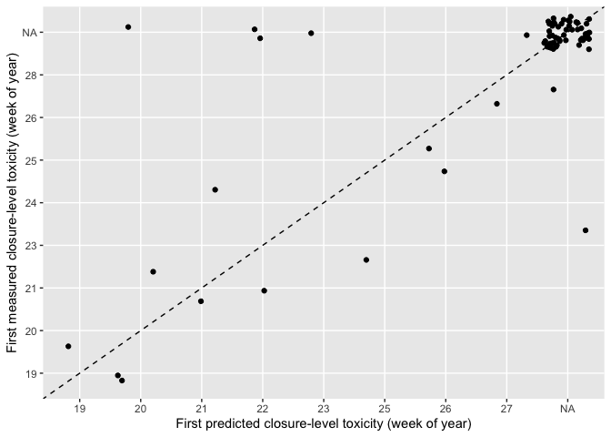

pspforecast
================

Shellfish toxicity forecast serving package

## Requirements

- [R v4+](https://www.r-project.org/)

- [rlang](https://CRAN.R-project.org/package=rlang)

- [dplyr](https://CRAN.R-project.org/package=dplyr)

- [readr](https://CRAN.R-project.org/package=readr)

- [tidyr](https://CRAN.R-project.org/package=tidyr)

- [httr](https://CRAN.R-project.org/package=httr)

## Installation

    remotes::install_github("BigelowLab/pspforecast")

## Reading the forecast database

### Variables:

- version - the version/configuration of the model used to make the
  prediction

- ensemble_n - number of ensemble members used to generate prediction

- location - the sampling station the forecast is for

- date - the date the forecast was made on

- name - site name

- lat - latitude

- lon - longitude

- class_bins - the bins used to classify shellfish total toxicity
  (i.e. 0: 0-10, 1: 10-30, 2: 30-80, 3: \>80)

- forecast_date - the date the forecast is valid for (i.e. one week
  ahead of when it was made)

- predicted_class - the predicted classification at the location listed
  on the forecast_date (in this case 0-3)

- p_0 - class 0 probability

- p_1 - class 1 probability

- p_2 - class 2 probability

- p_3 - class 3 probability

- p3_sd - class 3 probability standard deviation

- p_3\_min - class 3 minimum probability (from ensemble run)

- p_3\_max - class 3 maximum probability (from ensemble run)

- predicted_class - the predicted classification

``` r
predictions <- read_forecast(year = "2023") |>
  distinct()

glimpse(predictions)
```

    ## Rows: 474
    ## Columns: 19
    ## $ version             <chr> "v0.2.0", "v0.2.0", "v0.2.0", "v0.2.0", "v0.2.0", …
    ## $ ensemble_n          <dbl> 10, 10, 10, 10, 10, 10, 10, 10, 10, 10, 10, 10, 10…
    ## $ location            <chr> "PSP12.13", "PSP10.11", "PSP10.33", "PSP12.01", "P…
    ## $ date                <date> 2023-04-11, 2023-05-02, 2023-05-03, 2023-05-01, 2…
    ## $ name                <chr> "Lumbos Hole", "Ogunquit River", "Spurwink River",…
    ## $ lat                 <dbl> 43.79553, 43.25030, 43.56632, 43.73848, 43.73064, …
    ## $ lon                 <dbl> -69.94557, -70.59540, -70.27305, -70.04343, -70.02…
    ## $ class_bins          <chr> "0,10,30,80", "0,10,30,80", "0,10,30,80", "0,10,30…
    ## $ forecast_start_date <date> 2023-04-15, 2023-05-06, 2023-05-07, 2023-05-05, 2…
    ## $ forecast_end_date   <date> 2023-04-21, 2023-05-12, 2023-05-13, 2023-05-11, 2…
    ## $ p_0                 <dbl> 89, 98, 99, 97, 98, 96, 94, 98, 99, 99, 99, 99, 99…
    ## $ p_1                 <dbl> 9, 2, 1, 3, 2, 4, 5, 2, 1, 1, 1, 1, 1, 1, 1, 1, 1,…
    ## $ p_2                 <dbl> 2, 0, 0, 0, 0, 0, 1, 0, 0, 0, 0, 0, 0, 0, 0, 0, 0,…
    ## $ p_3                 <dbl> 0, 0, 0, 0, 0, 0, 0, 0, 0, 0, 0, 0, 0, 0, 0, 0, 0,…
    ## $ p3_sd               <dbl> 4.849940e-02, 4.066616e-05, 4.983161e-06, 8.274184…
    ## $ p_3_min             <dbl> 1.354318e-01, 3.799968e-05, 2.470616e-06, 1.027468…
    ## $ p_3_max             <dbl> 2.972137e-01, 1.736575e-04, 1.842741e-05, 3.850234…
    ## $ predicted_class     <dbl> 0, 0, 0, 0, 0, 0, 0, 0, 0, 0, 0, 0, 0, 0, 0, 0, 0,…
    ## $ f_id                <chr> "PSP12.13_2023-04-11", "PSP10.11_2023-05-02", "PSP…

## 2023 Season Results

### Confusion Matrix

<!-- -->

### Probability of Closure-level Toxicity vs Measured Toxicity

<!-- -->

### Metrics

#### Season Accuracy:

    ## # A tibble: 1 × 1
    ##   accuracy
    ##      <dbl>
    ## 1     0.99

#### Closure-level (Class 3) Predictions

- tp - The model predicted class 3 and the following week’s measurement
  was class 3
- fp - The model predicted class 3 and the following week’s measurement
  was not class 3
- tn - The model predicted class 0,1,2 and the following week’s
  measurement was in class 0,1,2
- fn - The model predicted class 0,1,2 and the following week’s
  measurement was class 3
- precision - TP/(TP+FP)
- sensitivity - TP/(TP+FN)
- specificity - TN/(TN+FP)

<!-- -->

    ## # A tibble: 1 × 7
    ##      tp    fp    tn    fn precision sensitivity specificity
    ##   <int> <int> <int> <int>     <dbl>       <dbl>       <dbl>
    ## 1     0     0   400     0       NaN         NaN           1

## 2022 Season Results

### Confusion Matrix

<!-- -->

### Probability of Closure-level Toxicity vs Measured Toxicity

<!-- -->

### Metrics

#### Season Accuracy:

    ## # A tibble: 1 × 1
    ##   accuracy
    ##      <dbl>
    ## 1    0.799

#### Closure-level (Class 3) Predictions

- tp - The model predicted class 3 and the following week’s measurement
  was class 3
- fp - The model predicted class 3 and the following week’s measurement
  was not class 3
- tn - The model predicted class 0,1,2 and the following week’s
  measurement was in class 0,1,2
- fn - The model predicted class 0,1,2 and the following week’s
  measurement was class 3
- precision - TP/(TP+FP)
- sensitivity - TP/(TP+FN)
- specificity - TN/(TN+FP)

<!-- -->

    ## # A tibble: 1 × 7
    ##      tp    fp    tn    fn precision sensitivity specificity
    ##   <int> <int> <int> <int>     <dbl>       <dbl>       <dbl>
    ## 1    16    20   603    12     0.444       0.571       0.968

### Timing of initial closure-level predictions

<!-- -->

## 2021 Season Results

### Confusion Matrix

<!-- -->

### Probability of Closure-level Toxicity vs Measured Toxicity

<!-- -->

### Metrics

#### Season Accuracy:

    ## # A tibble: 1 × 1
    ##   accuracy
    ##      <dbl>
    ## 1    0.938

#### Closure-level (Class 3) Predictions

- tp - The model predicted class 3 and the following week’s measurement
  was class 3
- fp - The model predicted class 3 and the following week’s measurement
  was not class 3
- tn - The model predicted class 0,1,2 and the following week’s
  measurement was in class 0,1,2
- fn - The model predicted class 0,1,2 and the following week’s
  measurement was class 3
- precision - TP/(TP+FP)
- sensitivity - TP/(TP+FN)
- specificity - TN/(TN+FP)

<!-- -->

    ## # A tibble: 1 × 7
    ##      tp    fp    tn    fn precision sensitivity specificity
    ##   <int> <int> <int> <int>     <dbl>       <dbl>       <dbl>
    ## 1     2     3   463     0       0.4           1       0.994

### Closure-level accuracy

### Timing of initial closure-level predictions

<!-- -->

### Possible manuscript plot

``` r
(confusion_matrix_21 + confusion_matrix_22 + confusion_matrix_23) / (p3_v_tox_21 + p3_v_tox_22 + p3_v_tox_23)
```

<!-- -->

### Last Updated

    ## [1] "2023-08-18"
