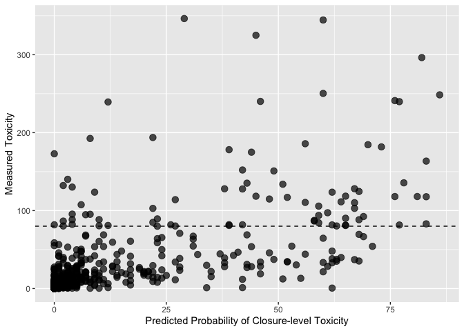

pspforecast
================

Shellfish toxicity (PSP) forecast serving package

For the current 2026 Maine PSP predictions, click
[here](https://github.com/BigelowLab/pspforecast/blob/master/inst/forecastdb/dmr_webpage_table.csv)

## Requirements

- [R v4+](https://www.r-project.org/)

- [rlang](https://CRAN.R-project.org/package=rlang)

- [dplyr](https://CRAN.R-project.org/package=dplyr)

- [readr](https://CRAN.R-project.org/package=readr)

- [tidyr](https://CRAN.R-project.org/package=tidyr)

- [httr](https://CRAN.R-project.org/package=httr)

## Installation

    remotes::install_github("BigelowLab/pspforecast")

## Reading the forecast database

### Variables:

- version - the version/configuration of the model used to make the
  prediction

- ensemble_n - number of ensemble members used to generate prediction

- location - the sampling station the forecast is for

- date - the date the forecast was made on

- name - site name

- lat - latitude

- lon - longitude

- class_bins - the bins used to classify shellfish total toxicity
  (i.e. 0: 0-10, 1: 10-30, 2: 30-80, 3: \>80)

- forecast_date - the date the forecast is valid for (i.e. one week
  ahead of when it was made)

- predicted_class - the predicted classification at the location listed
  on the forecast_date (in this case 0-3)

- p_0 - class 0 probability

- p_1 - class 1 probability

- p_2 - class 2 probability

- p_3 - class 3 probability

- p3_sd - class 3 probability standard deviation

- p_3_min - class 3 minimum probability (from ensemble run)

- p_3_max - class 3 maximum probability (from ensemble run)

- predicted_class - the predicted classification

### Metrics:

- tp - The model predicted class 3 and the following week’s measurement
  was class 3
- fp - The model predicted class 3 and the following week’s measurement
  was not class 3
- tn - The model predicted class 0,1,2 and the following week’s
  measurement was in class 0,1,2
- fn - The model predicted class 0,1,2 and the following week’s
  measurement was class 3
- accuracy - Measure of how many correct classifications were predicted
- cl_accuracy - Considering predictions are those that correctly
  predicted toxicity above or below the closure limit or not
- precision - TP/(TP+FP)
- sensitivity - TP/(TP+FN)
- specificity - TN/(TN+FP)
- f_1 - (2TP)/(2TP-FP+FN)

## Overall Results (2021-2025 seasons combined)

Predictions evaluated:

    ## [1] 2634

Metrics:

    ## # A tibble: 1 × 11
    ##      tp    fp    tn    fn accuracy cl_accuracy brier   f_1 precision sensitivity
    ##   <int> <int> <int> <int>    <dbl>       <dbl> <dbl> <dbl>     <dbl>       <dbl>
    ## 1    69    65  2449    51    0.806       0.956 0.028 0.543     0.515       0.575
    ## # ℹ 1 more variable: specificity <dbl>

## 2025 Results

<!-- -->

<!-- -->

### Predictions evaluated

    ## [1] 700

### Metrics

    ## # A tibble: 1 × 11
    ##      tp    fp    tn    fn accuracy cl_accuracy brier   f_1 precision sensitivity
    ##   <int> <int> <int> <int>    <dbl>       <dbl> <dbl> <dbl>     <dbl>       <dbl>
    ## 1    49    38   581    32    0.671         0.9 0.066 0.583     0.563       0.605
    ## # ℹ 1 more variable: specificity <dbl>

## 2024 Season Results

<!-- -->

<!-- -->

### Predictions evaluated

    ## [1] 410

### Metrics

    ## # A tibble: 1 × 11
    ##      tp    fp    tn    fn accuracy cl_accuracy brier   f_1 precision sensitivity
    ##   <int> <int> <int> <int>    <dbl>       <dbl> <dbl> <dbl>     <dbl>       <dbl>
    ## 1     2     4   397     7    0.717       0.973 0.017 0.267     0.333       0.222
    ## # ℹ 1 more variable: specificity <dbl>

## 2023 Season Results

### Confusion Matrix

<!-- -->

### Probability of Closure-level Toxicity vs Measured Toxicity

<!-- -->

### Predictions evaluated

    ## [1] 401

### Metrics

    ## # A tibble: 1 × 11
    ##      tp    fp    tn    fn accuracy cl_accuracy brier   f_1 precision sensitivity
    ##   <int> <int> <int> <int>    <dbl>       <dbl> <dbl> <dbl>     <dbl>       <dbl>
    ## 1     0     0   401     0     0.99           1     0   NaN       NaN         NaN
    ## # ℹ 1 more variable: specificity <dbl>

## 2022 Season Results

### Confusion Matrix

<!-- -->

### Probability of Closure-level Toxicity vs Measured Toxicity

<!-- -->

### Predictions evaluated

    ## [1] 651

### Metrics

    ## # A tibble: 1 × 11
    ##      tp    fp    tn    fn accuracy cl_accuracy brier   f_1 precision sensitivity
    ##   <int> <int> <int> <int>    <dbl>       <dbl> <dbl> <dbl>     <dbl>       <dbl>
    ## 1    16    20   603    12    0.799       0.951  0.03   0.5     0.444       0.571
    ## # ℹ 1 more variable: specificity <dbl>

### Timing of initial closure-level predictions

<!-- -->

## 2021 Season Results

### Confusion Matrix

<!-- -->

### Probability of Closure-level Toxicity vs Measured Toxicity

<!-- -->

### Predictions evaluated

    ## [1] 468

### Metrics

    ## # A tibble: 1 × 11
    ##      tp    fp    tn    fn accuracy cl_accuracy brier   f_1 precision sensitivity
    ##   <int> <int> <int> <int>    <dbl>       <dbl> <dbl> <dbl>     <dbl>       <dbl>
    ## 1     2     3   463     0    0.938       0.994 0.005 0.571       0.4           1
    ## # ℹ 1 more variable: specificity <dbl>

### Closure-level accuracy

### Timing of initial closure-level predictions

<!-- -->

### Last Updated

    ## [1] "2026-02-17"
