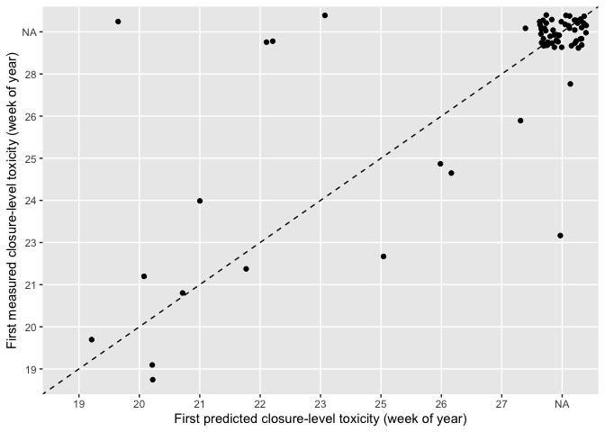
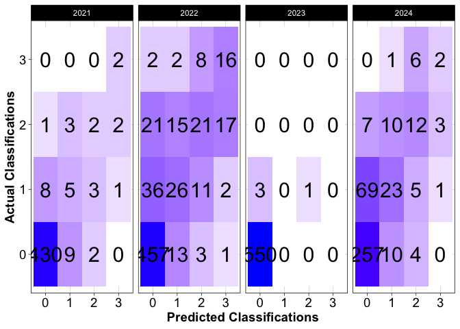

pspforecast
================

Shellfish toxicity forecast serving package

## Requirements

- [R v4+](https://www.r-project.org/)

- [rlang](https://CRAN.R-project.org/package=rlang)

- [dplyr](https://CRAN.R-project.org/package=dplyr)

- [readr](https://CRAN.R-project.org/package=readr)

- [tidyr](https://CRAN.R-project.org/package=tidyr)

- [httr](https://CRAN.R-project.org/package=httr)

## Installation

    remotes::install_github("BigelowLab/pspforecast")

## Reading the forecast database

### Variables:

- version - the version/configuration of the model used to make the
  prediction

- ensemble_n - number of ensemble members used to generate prediction

- location - the sampling station the forecast is for

- date - the date the forecast was made on

- name - site name

- lat - latitude

- lon - longitude

- class_bins - the bins used to classify shellfish total toxicity
  (i.e. 0: 0-10, 1: 10-30, 2: 30-80, 3: \>80)

- forecast_date - the date the forecast is valid for (i.e. one week
  ahead of when it was made)

- predicted_class - the predicted classification at the location listed
  on the forecast_date (in this case 0-3)

- p_0 - class 0 probability

- p_1 - class 1 probability

- p_2 - class 2 probability

- p_3 - class 3 probability

- p3_sd - class 3 probability standard deviation

- p_3_min - class 3 minimum probability (from ensemble run)

- p_3_max - class 3 maximum probability (from ensemble run)

- predicted_class - the predicted classification

``` r
predictions <- read_forecast(year = "2024") |>
  distinct()

glimpse(predictions)
```

    ## Rows: 428
    ## Columns: 19
    ## $ version             <chr> "v0.3.0", "v0.3.0", "v0.3.0", "v0.3.0", "v0.3.0", "v0.3.0", "v0.3.0", "v0.3.0", "v0.3.0", "v0.3.0", "v0.3.0", "v0.3.0", "v0.3.0", "v0.3.0", "v0.3.0", "v0.3.0", "v0.3.0", "v0.3.0", "v0.3.0", "v0.3.0", "v0.3.0", "v0.3.0", "v…
    ## $ ensemble_n          <dbl> 10, 10, 10, 10, 10, 10, 10, 10, 10, 10, 10, 10, 10, 10, 10, 10, 10, 10, 10, 10, 10, 10, 10, 10, 10, 10, 10, 10, 10, 10, 10, 10, 10, 10, 10, 10, 10, 10, 10, 10, 10, 10, 10, 10, 10, 10, 10, 10, 10, 10, 10, 10, 10, 10, 10, 10…
    ## $ location            <chr> "PSP10.11", "PSP10.33", "PSP12.01", "PSP12.03", "PSP12.13", "PSP12.28", "PSP12.34", "PSP15.25", "PSP16.41", "PSP19.15", "PSP21.09", "PSP27.05", "PSP27.46", "PSP10.11", "PSP10.33", "PSP11.110", "PSP11.115", "PSP11.117", "PS…
    ## $ date                <date> 2024-05-06, 2024-05-06, 2024-05-08, 2024-05-08, 2024-05-08, 2024-05-06, 2024-05-06, 2024-05-06, 2024-05-06, 2024-05-06, 2024-05-06, 2024-05-07, 2024-05-07, 2024-05-14, 2024-05-14, 2024-05-13, 2024-05-13, 2024-05-13, 2024-…
    ## $ name                <chr> "Ogunquit River", "Spurwink River", "Basin Pt.", "Potts Pt.", "Lumbos Hole", "Bear Island", "Head Beach", "Christmas Cove Town Landing", "Port Clyde", "Stonington", "Bass Hbr.", "Gove Pt.", "Gleason Cove", "Ogunquit River"…
    ## $ lat                 <dbl> 43.25030, 43.56632, 43.73848, 43.73064, 43.79553, 43.78556, 43.71711, 43.84476, 43.92526, 44.15419, 44.23824, 44.90545, 44.97084, 43.25030, 43.56632, 43.72800, 43.73316, 43.71190, 43.73848, 43.73064, 43.74995, 43.81755, 43…
    ## $ lon                 <dbl> -70.59540, -70.27305, -70.04343, -70.02556, -69.94557, -69.87415, -69.84999, -69.55365, -69.25900, -68.65947, -68.34792, -67.05621, -67.05254, -70.59540, -70.27305, -70.09500, -70.16358, -70.18787, -70.04343, -70.02556, -6…
    ## $ class_bins          <chr> "0,10,30,80", "0,10,30,80", "0,10,30,80", "0,10,30,80", "0,10,30,80", "0,10,30,80", "0,10,30,80", "0,10,30,80", "0,10,30,80", "0,10,30,80", "0,10,30,80", "0,10,30,80", "0,10,30,80", "0,10,30,80", "0,10,30,80", "0,10,30,80"…
    ## $ forecast_start_date <date> 2024-05-10, 2024-05-10, 2024-05-12, 2024-05-12, 2024-05-12, 2024-05-10, 2024-05-10, 2024-05-10, 2024-05-10, 2024-05-10, 2024-05-10, 2024-05-11, 2024-05-11, 2024-05-18, 2024-05-18, 2024-05-17, 2024-05-17, 2024-05-17, 2024-…
    ## $ forecast_end_date   <date> 2024-05-16, 2024-05-16, 2024-05-18, 2024-05-18, 2024-05-18, 2024-05-16, 2024-05-16, 2024-05-16, 2024-05-16, 2024-05-16, 2024-05-16, 2024-05-17, 2024-05-17, 2024-05-24, 2024-05-24, 2024-05-23, 2024-05-23, 2024-05-23, 2024-…
    ## $ p_0                 <dbl> 93, 100, 100, 99, 31, 3, 95, 94, 95, 95, 100, 99, 100, 55, 91, 38, 39, 53, 98, 91, 69, 57, 37, 2, 93, 97, 66, 98, 100, 99, 98, 19, 6, 17, 75, 60, 86, 89, 63, 94, 46, 5, 61, 99, 83, 41, 93, 6, 26, 72, 96, 95, 95, 98, 89, 96…
    ## $ p_1                 <dbl> 6, 0, 0, 1, 44, 13, 4, 5, 4, 5, 0, 1, 0, 42, 9, 40, 46, 37, 2, 9, 26, 32, 36, 10, 6, 3, 28, 2, 0, 1, 2, 52, 29, 43, 21, 33, 13, 10, 30, 6, 42, 24, 31, 1, 15, 39, 7, 20, 39, 23, 4, 5, 5, 2, 10, 4, 2, 9, 9, 8, 15, 31, 11, 24…
    ## $ p_2                 <dbl> 1, 0, 0, 0, 18, 43, 0, 1, 0, 0, 0, 0, 0, 2, 0, 17, 12, 8, 0, 0, 4, 9, 21, 39, 0, 0, 5, 0, 0, 0, 0, 27, 44, 34, 3, 7, 1, 1, 6, 0, 11, 40, 7, 0, 1, 16, 0, 41, 26, 4, 0, 0, 0, 0, 1, 0, 0, 1, 38, 38, 46, 32, 1, 11, 5, 25, 0, 5…
    ## $ p_3                 <dbl> 0, 0, 0, 0, 7, 42, 0, 0, 0, 0, 0, 0, 0, 0, 0, 5, 3, 2, 0, 0, 1, 2, 6, 50, 0, 0, 1, 0, 0, 0, 0, 2, 21, 5, 1, 1, 0, 0, 1, 0, 1, 32, 1, 0, 0, 4, 0, 33, 10, 1, 0, 0, 0, 0, 0, 0, 0, 0, 52, 54, 38, 17, 0, 5, 1, 8, 0, 1, 1, 4, 0,…
    ## $ p3_sd               <dbl> 2.537746e-02, 1.702311e-04, 5.835063e-07, 3.170006e-04, 2.573652e+00, 1.032039e+01, 6.801030e-03, 1.598628e-02, 8.719488e-03, 4.358502e-03, 1.378183e-06, 5.185523e-05, 5.231048e-07, 2.781944e-01, 2.931956e-02, 2.222504e+00…
    ## $ p_3_min             <dbl> 2.803591e-02, 1.613240e-06, 4.298889e-09, 3.494154e-05, 3.757856e+00, 2.148448e+01, 6.643038e-03, 1.782123e-02, 9.030735e-03, 2.118392e-03, 9.372612e-10, 3.377466e-06, 2.084870e-10, 1.508329e-02, 3.404170e-04, 2.190988e+00…
    ## $ p_3_max             <dbl> 1.114067e-01, 5.424280e-04, 1.839769e-06, 9.452227e-04, 1.157185e+01, 5.338209e+01, 3.128168e-02, 7.217547e-02, 3.986240e-02, 1.588983e-02, 4.431532e-06, 1.838427e-04, 1.674185e-06, 9.820972e-01, 9.217632e-02, 9.631202e+00…
    ## $ predicted_class     <dbl> 0, 0, 0, 0, 1, 2, 0, 0, 0, 0, 0, 0, 0, 0, 0, 1, 1, 0, 0, 0, 0, 0, 0, 3, 0, 0, 0, 0, 0, 0, 0, 1, 2, 1, 0, 0, 0, 0, 0, 0, 0, 2, 0, 0, 0, 0, 0, 2, 1, 0, 0, 0, 0, 0, 0, 0, 0, 0, 3, 3, 2, 2, 0, 0, 0, 1, 0, 0, 0, 0, 0, 0, 0, 1, …
    ## $ f_id                <chr> "PSP10.11_2024-05-06", "PSP10.33_2024-05-06", "PSP12.01_2024-05-08", "PSP12.03_2024-05-08", "PSP12.13_2024-05-08", "PSP12.28_2024-05-06", "PSP12.34_2024-05-06", "PSP15.25_2024-05-06", "PSP16.41_2024-05-06", "PSP19.15_2024-…

## 2024 Season Results

<!-- -->

<!-- -->

### Metrics

#### Season Accuracy:

    ## # A tibble: 1 × 1
    ##   accuracy
    ##      <dbl>
    ## 1    0.697

#### Closure-level (Class 3) Predictions

- tp - The model predicted class 3 and the following week’s measurement
  was class 3
- fp - The model predicted class 3 and the following week’s measurement
  was not class 3
- tn - The model predicted class 0,1,2 and the following week’s
  measurement was in class 0,1,2
- fn - The model predicted class 0,1,2 and the following week’s
  measurement was class 3
- precision - TP/(TP+FP)
- sensitivity - TP/(TP+FN)
- specificity - TN/(TN+FP)

<!-- -->

    ## # A tibble: 1 × 8
    ##      tp    fp    tn    fn cl_accuracy precision sensitivity specificity
    ##   <int> <int> <int> <int>       <dbl>     <dbl>       <dbl>       <dbl>
    ## 1     2     4   360     7       0.971     0.333       0.222       0.989

## 2023 Season Results

``` r
predictions <- read_forecast(year = "2023")
```

### Confusion Matrix

<!-- -->

### Probability of Closure-level Toxicity vs Measured Toxicity

<!-- -->

### Metrics

#### Season Accuracy:

    ## # A tibble: 1 × 1
    ##   accuracy
    ##      <dbl>
    ## 1    0.993

#### Closure-level (Class 3) Predictions

- tp - The model predicted class 3 and the following week’s measurement
  was class 3
- fp - The model predicted class 3 and the following week’s measurement
  was not class 3
- tn - The model predicted class 0,1,2 and the following week’s
  measurement was in class 0,1,2
- fn - The model predicted class 0,1,2 and the following week’s
  measurement was class 3
- precision - TP/(TP+FP)
- sensitivity - TP/(TP+FN)
- specificity - TN/(TN+FP)

<!-- -->

    ## # A tibble: 1 × 8
    ##      tp    fp    tn    fn cl_accuracy precision sensitivity specificity
    ##   <int> <int> <int> <int>       <dbl>     <dbl>       <dbl>       <dbl>
    ## 1     0     0   554     0           1       NaN         NaN           1

## 2022 Season Results

### Confusion Matrix

<!-- -->

### Probability of Closure-level Toxicity vs Measured Toxicity

<!-- -->

### Metrics

#### Season Accuracy:

    ## # A tibble: 1 × 1
    ##   accuracy
    ##      <dbl>
    ## 1    0.799

#### Closure-level (Class 3) Predictions

- tp - The model predicted class 3 and the following week’s measurement
  was class 3
- fp - The model predicted class 3 and the following week’s measurement
  was not class 3
- tn - The model predicted class 0,1,2 and the following week’s
  measurement was in class 0,1,2
- fn - The model predicted class 0,1,2 and the following week’s
  measurement was class 3
- precision - TP/(TP+FP)
- sensitivity - TP/(TP+FN)
- specificity - TN/(TN+FP)

<!-- -->

    ## # A tibble: 1 × 8
    ##      tp    fp    tn    fn cl_accuracy precision sensitivity specificity
    ##   <int> <int> <int> <int>       <dbl>     <dbl>       <dbl>       <dbl>
    ## 1    16    20   603    12       0.951     0.444       0.571       0.968

### Timing of initial closure-level predictions

<!-- -->

## 2021 Season Results

### Confusion Matrix

<!-- -->

### Probability of Closure-level Toxicity vs Measured Toxicity

<!-- -->

### Metrics

#### Season Accuracy:

    ## # A tibble: 1 × 1
    ##   accuracy
    ##      <dbl>
    ## 1    0.938

#### Closure-level (Class 3) Predictions

- tp - The model predicted class 3 and the following week’s measurement
  was class 3
- fp - The model predicted class 3 and the following week’s measurement
  was not class 3
- tn - The model predicted class 0,1,2 and the following week’s
  measurement was in class 0,1,2
- fn - The model predicted class 0,1,2 and the following week’s
  measurement was class 3
- precision - TP/(TP+FP)
- sensitivity - TP/(TP+FN)
- specificity - TN/(TN+FP)

<!-- -->

    ## # A tibble: 1 × 8
    ##      tp    fp    tn    fn cl_accuracy precision sensitivity specificity
    ##   <int> <int> <int> <int>       <dbl>     <dbl>       <dbl>       <dbl>
    ## 1     2     3   463     0       0.994       0.4           1       0.994

### Closure-level accuracy

### Timing of initial closure-level predictions

<!-- -->

### Possible manuscript plot(s)

<!-- -->

<!-- -->

### Last Updated

    ## [1] "2024-08-09"
